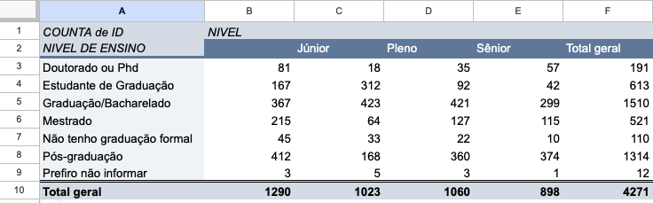
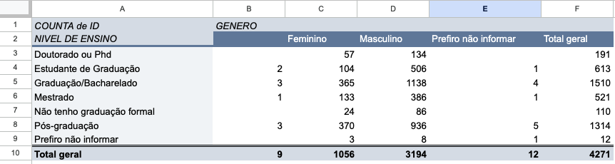
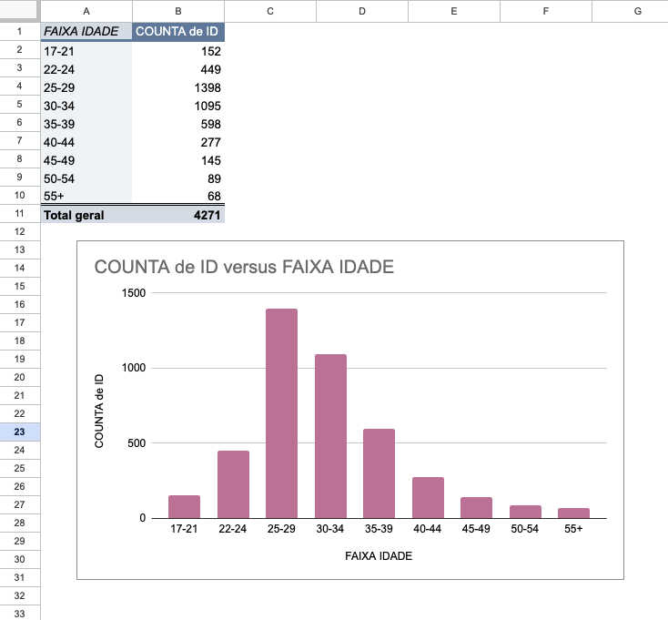
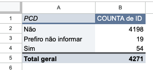
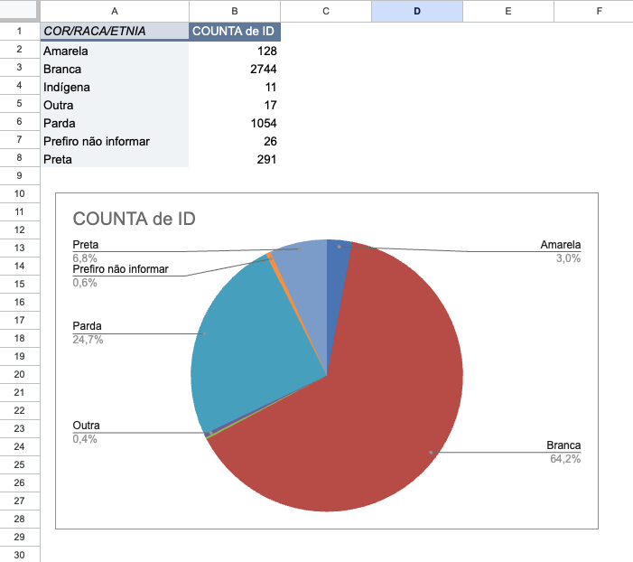
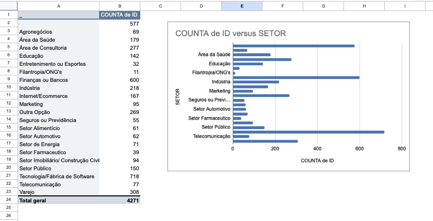
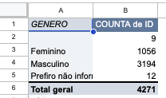

# Módulo 1 — Explorando Dados com Google Planilhas (Tabelas Dinâmicas & Gráficos)

Nesse primeiro módulo aprendemos como criar filtros e colunas novas para analisar os dados utilizando o Google Planilhas. Com ele agrupamos os dados criando tabelas dinâmicas e criamos gráficos para responder algumas perguntas sobre o mercado de tecnologia.

> **Base de dados:** `planilha_modulo2` — pesquisa sobre o mercado de tecnologia realizada pelo Data Hackers em 2022.

---

## Perguntas & Análises

### 1. Será que quanto maior a formação, maior o nível?

**Pivot:** Nível de Ensino × Nível (Júnior, Pleno, Sênior)
**Valor:** CONTAGEM de IDs

**Observação:** Os dados mostram que Graduação/Bacharelado (1510) e Pós-graduação (1314) concentram o maior número de respondentes. Porém, ter uma formação mais alta não significa necessariamente um nível mais alto — por exemplo, Pós-graduação tem mais Júnior (412) do que Sênior (374).

---

### 2. Será que tem mais homens ou mulheres com Pós-Graduação?

**Pivot:** Nível de Ensino × Gênero
**Valor:** CONTAGEM de IDs

**Observação:** Entre os respondentes com Pós-graduação (1314 no total), os homens dominam com 936, contra apenas 370 mulheres. Esse padrão se repete em quase todos os níveis de ensino, refletindo um desequilíbrio de gênero no mercado de tecnologia brasileiro.

---

### 3. Qual é a distribuição de idade dos respondentes?

**Pivot:** Faixa de Idade (FAIXA IDADE)
**Valor:** CONTAGEM de IDs | **Tipo de gráfico:** Gráfico de barras

**Observação:** A maioria dos respondentes tem entre 25–29 anos (1398), seguido por 30–34 anos (1095). 

---

### 4. Quantos respondentes são PCD (Pessoa com Deficiência)?

**Pivot:** PCD
**Valor:** CONTAGEM de IDs

**Observação:** A grande maioria dos respondentes não é PCD (4198 de 4271). Apenas 54 respondentes se identificaram como PCD (~1,3%), o que pode refletir baixa representatividade ou subnotificação no setor de tecnologia.

---

### 5. Qual é a composição racial/étnica dos respondentes?

**Pivot:** Cor/Raça/Etnia (COR/RAÇA/ETNIA)
**Valor:** CONTAGEM de IDs | **Tipo de gráfico:** Gráfico de pizza

**Observação:** Respondentes brancos representam 64,2% do total (2744). Pardos são o segundo maior grupo com 24,7% (1054), seguido de Pretos com 6,8% (291). 

---

### 6. Quais setores concentram mais profissionais de tecnologia?

**Pivot:** Setor (SETOR)
**Valor:** CONTAGEM de IDs | **Tipo de gráfico:** Gráfico de barras horizontal

**Observação:** Tecnologia/Fábrica de Software lidera com 718 respondentes, seguido de Finanças ou Bancos com 600 e uma categoria sem rótulo com 577. Isso mostra que os profissionais de tecnologia estão fortemente concentrados nos setores de tech e finanças.

---

### 7. Qual é a distribuição de gênero dos respondentes?

**Pivot:** Gênero (GÊNERO)
**Valor:** CONTAGEM de IDs

**Observação:** Homens representam a grande maioria com 3194 respondentes (74,8%), enquanto mulheres somam apenas 1056 (24,7%). Apenas 12 respondentes preferiram não se identificar. Isso evidencia um grande gap de gênero no mercado de tecnologia brasileiro.
